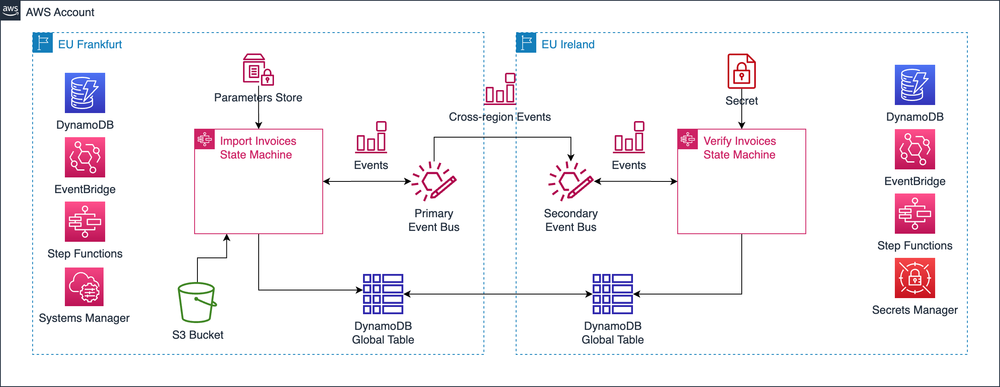

# Sample Functionless Application

## Invoice Processing



## Components

This CDK application deploys 3 CDK stacks in 2 regions:

- SharedResourcesStack (primary region)
- ImportInvoicesStack (primary region)
- VerifyInvoicesStack (secondary region)

Application consists of the following AWS resources:

- DynamoDB global table
- Step Functions state machines
- EventBridge event buses
- EventBridge event rules
- SSM Parameter Store parameters
- Secrets Manager secret
- CloudWatch log groups
- S3 bucket

## Context

Modify the `cdk.context.json` file to change deployment regions:

```json
{
  "regions": {
    "primary": "eu-central-1",
    "secondary": "eu-west-1"
  }
}
```

## Useful commands

* `npm run build`         compiles TypeScript to JavaScript
* `cdk synth --all`       emits the synthesized CloudFormation templates
* `cdk deploy --all`      deploys all stacks to your default AWS account
* `cdk destroy --all`     destroys all stacks from your AWS account
